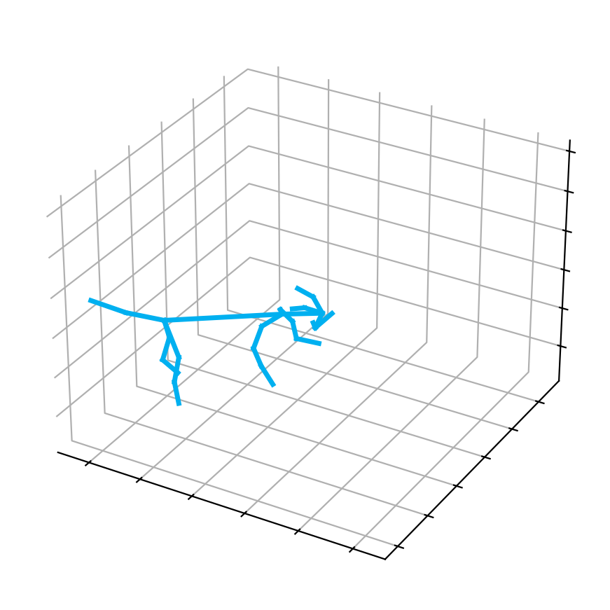

# Animals

In this part, the FMPose3D model is trained on [Animal3D](https://xujiacong.github.io/Animal3D/) dataset and [Control_Animal3D](https://luoxue-star.github.io/AniMer_project_page/) dataset.
## Demo

### Testing on in-the-wild images (animals)

This visualization script is designed for single-frame based model, allowing you to easily run 3D animal pose estimation on any single image.

Before testing, make sure you have the pre-trained model ready.
You may either use the model trained by your own or download ours from [here](https://drive.google.com/drive/folders/1fMKVaYziwFkAnFrtQZmoPOTfe7Hkl2at?usp=sharing) and place it in the `./pre_trained_models` directory.

Next, put your test images into folder `demo/images`. Then run the visualization script:
```bash
sh vis_animals.sh
```
The predictions will be saved to folder `demo/predictions`.

<p align="center">


</p>


## Datasets

Download the Animal3D dataset from [here](https://drive.google.com/drive/folders/17KRe8Z7jCZNDeBu45Wx2zS8Yh2tV_t2v)

Download the control_animal3D dataset from [here](https://drive.google.com/file/d/1-qDn2V_2OkbwwgfIwuSyx1thnNizhfqG/view?usp=drive_link) 

Place the downloaded files in the `dataset/` folder of this project:

```
<project_root>/
├── dataset/
│   ├── animal3d
│       ├── images
│       ├── train.json
│       ├── test.json
│   ├── control_animal3d
│       ├── images
│       ├── train.json
│       ├── test.json

```

## Training
The training logs, checkpoints, and related files of each training time will be saved in the './checkpoint' folder.

For trainig on the two datasets:

```bash
cd animals
bash ./scripts/train_animal3d.sh
```

## Inference
Download the pretrained model from [here](https://drive.google.com/drive/folders/1fMKVaYziwFkAnFrtQZmoPOTfe7Hkl2at?usp=sharing) and place it in the `./pre_trained_models` directory. 

```bash
cd animals # the current path is: ./animals
bash ./scripts/test_animal3d.sh
```
